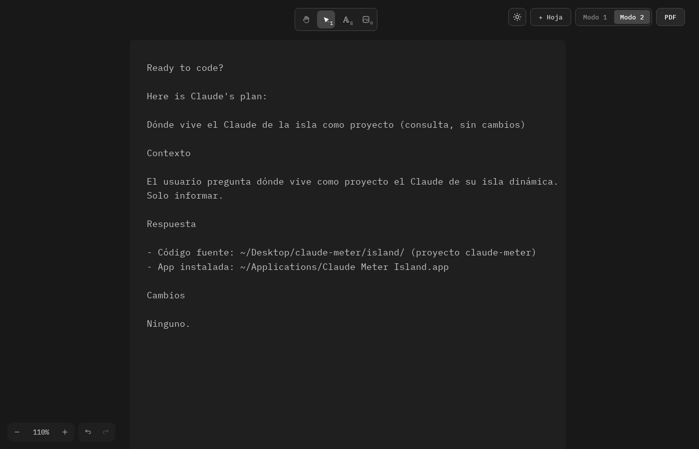

# Wox

Una hoja A4 en blanco donde colocas texto e imágenes donde quieras, y la descargas en PDF con un clic. Sin cuentas, sin servidor: todo ocurre en tu navegador.

**Úsalo aquí → https://bortrax25.github.io/wox/**



## Qué hace

- **Texto e imágenes libres** sobre hojas A4 reales (210 × 297 mm). Escribe, pega o arrastra imágenes y muévelas como quieras.
- **Modo 1 / Modo 2**: texto en Arial, o el estilo del editor Zed (IBM Plex Mono).
- **Día / noche** con un clic.
- **PDF tal como lo ves**: una página por hoja, con la letra del modo y los colores de día o de noche. El texto se puede seleccionar.
- **Varias hojas** con *+ Hoja*.
- **Se guarda solo** en tu navegador.
- **Instalable y sin internet**: en Safari, *Archivo → Añadir al Dock*; en Chrome, el icono de instalar en la barra de direcciones; en el móvil, *Compartir → Añadir a pantalla de inicio*. Después de la primera visita funciona sin conexión y se actualiza sola.

Tus documentos se quedan en el navegador de cada dispositivo: no se suben a ningún sitio ni se sincronizan entre dispositivos.

## Publicación

Se publica en GitHub Pages con cada cambio en `main` (`.github/workflows/deploy.yml`). Requisito de GitHub, una sola vez: *Settings → Pages → Source: GitHub Actions*.

## Uso local

```bash
git clone https://github.com/bortrax25/wox.git
cd wox
npm install
npm run dev      # http://localhost:5173
npm run build    # genera dist/ (sitio estático, sin backend)
npm run lint
```

`npm run dev` y `npm run build` copian antes las fuentes de Excalidraw a `public/excalidraw-assets/` (carpeta ignorada por git) para servirlas localmente, sin depender de un CDN.

- **Texto**: herramienta `T` (o doble clic en la hoja). Para que un párrafo largo haga salto de línea automático, arrastra el borde lateral de la caja de texto: queda con ancho fijo.
- **Imágenes**: herramienta de imagen, pegar (`Ctrl+V`) o arrastrar desde el escritorio. Se mueven y redimensionan libremente.
- **+ Hoja**: agrega otra hoja A4 debajo de la última (`Ctrl+Z` la quita).
- **Modo 1 / Modo 2** (junto al botón PDF): estilo del documento. Modo 1: texto en Liberation Sans (Arial). Modo 2: estilo del editor Zed, con texto e interfaz en IBM Plex Mono e interlineado 1,618. Al cambiar, todos los textos se recalculan para no descuadrarse.
- **Día / noche** (botón sol/luna): independiente del modo. De noche la hoja se ve como Zed (fondo `#1f1f1f`, texto `#cccccc`).
- **PDF**: descarga `documento.pdf` con una página por hoja, tal como se ve: con la letra del modo y, de noche, con fondo `#1f1f1f` y texto `#cccccc` (de día, blanco y negro). Solo se incluye lo que está dentro de cada hoja.
- Todo se guarda solo en `localStorage` y se restaura al recargar.

El plan original de implementación está en [PLAN.md](PLAN.md).

## Cómo está hecho

| Archivo | Contenido |
| --- | --- |
| `src/App.tsx` | Monta `<Excalidraw />`, valores por defecto, botones, restricción de herramientas y autoguardado. |
| `src/a4.ts` | Hoja A4: frame de 794 × 1123 px (A4 a 96 ppp) + rectángulo blanco de fondo, ambos `locked`. |
| `src/pdf.ts` | Exportación a PDF (vectorial con respaldo en PNG). |
| `src/storage.ts` | Autoguardado en `localStorage` con debounce. |
| `src/mode.ts` | Modo 1 / Modo 2: fuente e interlineado de los textos. |
| `src/theme.ts` | Día / noche, guardado en `localStorage`. |
| `vite.config.ts` | Rutas relativas y app instalable/sin conexión (`vite-plugin-pwa`). |
| `.github/workflows/deploy.yml` | Publicación en GitHub Pages. |
| `src/index.css` | Pantalla completa, interfaz mínima (oculta herramientas y paneles con `:has()`) y estilos de ambos temas. |

Versión verificada: `@excalidraw/excalidraw` **0.18.1**.

### Fuente (Arial)

- Excalidraw 0.18.1 **no tiene API pública para registrar una fuente propia** (como Arimo): el registro (`Fonts.register`) es interno y solo acepta las familias de `FONT_FAMILY`.
- Sí incluye **Liberation Sans** (`FONT_FAMILY["Liberation Sans"]`), que tiene las mismas métricas que Arial (igual que Arimo). Es la fuente por defecto, a 16 px (12 pt).
- El texto escrito con otras fuentes (p. ej. de una sesión anterior) se conserva tal cual.
- **Modo 2 (IBM Plex Mono)**: como no hay API para fuentes propias, se usa la familia `FONT_FAMILY.Cascadia` (oculta en la interfaz) y `scripts/copy-excalidraw-fonts.mjs` sirve en su lugar el archivo de IBM Plex Mono (paquete `@ibm/plex-mono`), además de su TTF para el PDF. En el PDF la fuente aparece con su nombre real.

### PDF

1. **Vectorial (por defecto)**: `exportToSvg` del frame + `svg2pdf.js`. Liberation Sans se embebe en el PDF (jsPDF necesita un TTF, que se genera a partir del woff2 de Excalidraw con `wawoff2`). El texto es nítido y seleccionable.
2. **PNG (respaldo)**: `exportToBlob` del frame a escala 3 (288 ppp) insertado a 210 × 297 mm. Se usa en una página cuando contiene algo que el modo vectorial no reproduce fielmente (imágenes recortadas, texto en otras fuentes o con caracteres que Liberation Sans no cubre, como emojis o CJK), o para todo el documento si el modo vectorial falla.

De noche, en el PDF vectorial los colores del SVG pasan por la misma fórmula que el filtro de pantalla (las imágenes conservan sus colores), y en el PNG se usa el modo oscuro de Excalidraw con un ajuste lineal de tonos para llegar a los mismos `#1f1f1f` / `#cccccc`.

Antes de pasar el SVG a svg2pdf, cada imagen (`<use>` → `<symbol>`) se sustituye por un `<image>` directo, porque si no svg2pdf la deforma.

## Limitaciones

- El texto no fluye: cada texto es una caja independiente y no hay salto de página automático.
- `localStorage` tiene un límite de ~5 MB; con imágenes grandes el autoguardado puede fallar (se avisa con un mensaje).
- La posición vertical del texto en el PDF vectorial puede diferir < 1 mm de la pantalla (diferencia de línea base entre canvas y SVG).
